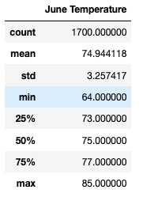
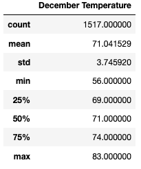
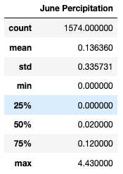
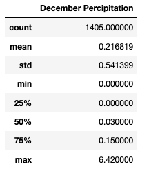

# Oahu Surf Shop Analysis

## Overview

The purpose of this project is to analyze weather data using SQLite to see if it is a smart business plan to open up a surf shop on the island of Oahu.

## Results 

The results of this analysis are comprised of annual temperature data from the months of June and December.

### Information for the month of June 

1. The average temperature is 74.94 degrees fahrenheit
2. The minimum temperature is 64 degrees fahrenheit
3. The maximum temperature is 85 degrees fahrenheit

This data is comprised of 1700 entries.

### Information for the month of December

1. The average temperature is 71.04 degrees fahrenheit
2. The minimum temperature is 56 degrees fahrenheit
3. The maximum temperature is 83 degrees fahrenheit

This data is comprised of 1517 entries.

### Summary

By looking at the results, opening a surf shop would be a smart investment. Overall, there is an enjoyable average temperature in two months that are 6 months apart from one another. For most of the year, there will be desired temperatures for people to come and use the surf shop.

Analyzing a little deeper by reviewing the percipitation levels through the two months as well we find the following:

1. The average percipitation is 0.136 inches per day in June
2. The average percipitation is 0.217 inches per day in December
3. 50% of days in June have less than 0.02 inches of percipitation and 75% have less than 0.12 inches of percipitation
4. 50% of days in December have less than 0.02 inches of percipitation and 75% have less than 0.12 inches of percipitation
5. The maximum percipitation is 4.43 inches on a single day in June
6. The maximum percipitation is 6.42 inches on a single day in December

By conducting this further analysis it shows that there is very low amounts of percipitation on a normal day, even though there are still some days with excessive rainfall. This shows that the surf shop will be able to stay open on most days of the year. 
